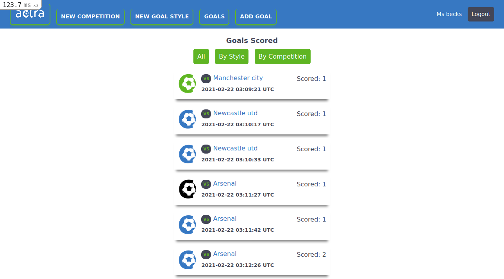

# ACTRA

## Definition

> Actra is a goal tracking application which keeps a record of all goals scored by a team player and groups it into *goal styles* and *competitons* to easily analyse the goal scoring performance of the player. This application is best suited for goal scoring sports like football(soccer), handball

## About the Project

The objective of this project is build a rails application making use of __groupings__ and to host it on Heroku.
The entire project was built with ```ruby-on-rails```, ```erb```, and ```sass```

## Built With

- Ruby
- Ruby-on-Rails (ROR)
- ERB (DSL)
- SASS

## Video Presentation
[Video presentation](https://www.loom.com/share/c847e570b8904f93bb13a35f705b8eab)

### Live DEMO
[Vist](https://actra.herokuapp.com/)

## Getting Started

### Prerequisites
- Ruby : you need ruby installed on your local pc
- Rails : You need ```rials``` gem installed [guide](https://guides.rubyonrails.org/v5.0/getting_started.html)
- Postgresql
### Setup

```
git clone https://github.com/Misori-simon/actra.git
```

```
cd actra
```

```
bundle install
```

```
yarn install
```
- create a database
```
rails db:create
```
- Run all migrations
```
rails db:migrate
```
- To start the server

```
rails server
```
- In your browser, visit ```localhost:3000```
- You can create an account with the signup *profile image is required*
- To start recording your goals, you need to have atleast one goal style and one competition added *images also required*

## Testing
- To run tests, go to the root folder of the application. Run
```
rspec --format documentation
```
-

## Screenshots
- User Profile


- User Goals


- New goal


- New goal style


- New competiton


- Login


- Sign up


## Authors

👤 **Misori Simon**

  - GitHub: [Misori-simon](https://github.com/Misori-simon/)
  - Twitter: [@misori_simon](https://twitter.com/misori_simon)
  - LinkedIn: [Misori Simon](https://cm.linkedin.com/in/misori-simon-05906219b)


## 🤝 Contributing

Contributions, issues, and feature requests are welcome!

## Show your support

Give a ⭐️ if you like this project!

## Acknowledgments
- [Gregoire Vella](http://www.gregoirevella.com/) for his [UI design](https://www.behance.net/gallery/19759151/Snapscan-iOs-design-and-branding?tracking_source=)

